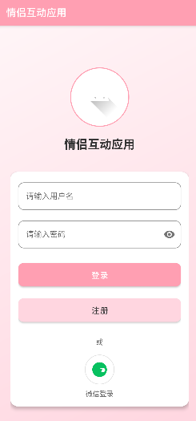
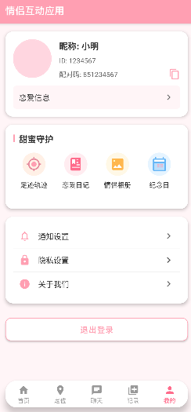

使用cursor开发的情侣定位安卓应用,目前只有界面,没有功能,登录账号密码都是1
截图





# 情侣空间 (Couple Space)


## 项目简介

情侣空间是一款专为情侣设计的Android应用，提供了丰富的功能帮助情侣记录和分享美好时光。应用采用了温馨的粉色系设计，界面简洁友好，为情侣提供了一个私密、温馨的交流空间。通过独特的配对码系统，情侣可以轻松连接彼此的账号，共享专属于两人的数字空间。

## 主要功能

### 甜蜜守护
- **足迹轨迹**：记录并分享你们共同的旅行足迹，查看历史位置和路线
- **恋爱日记**：记录每一个值得纪念的瞬间，支持图文混排和心情标签
- **情侣相册**：存储和分享你们的珍贵照片，自动整理和分类
- **纪念日**：重要日期提醒，不错过任何一个特殊日子，支持自定义纪念日类型

### 互动功能
- **私密聊天**：端到端加密的聊天系统，保护你们的隐私
- **表情包和贴纸**：丰富的情侣专属表情和贴纸
- **桌面贴贴**：可以添加到桌面的小组件，随时传递爱的信息
- **实时通知**：重要消息和事件的即时提醒

### 个人中心
- **个人资料管理**：自定义头像、昵称和个人信息
- **配对码系统**：独特的配对机制，确保只与伴侣连接
- **隐私设置**：精细的隐私控制选项
- **通知管理**：自定义通知方式和频率

## 技术特点

- 采用Material Design设计规范，提供现代化的用户界面
- 使用AndroidX组件库和Jetpack架构组件
- 实现了响应式UI设计，适配各种屏幕尺寸
- 采用MVVM架构模式，提高代码可维护性
- 使用Room数据库进行本地数据存储
- 集成Firebase实现云同步和消息推送
- 支持深色模式和动态主题

## 安装要求

- Android 6.0 (API级别23)或更高版本
- 至少100MB的可用存储空间
- 网络连接（用于同步数据）
- 位置服务（用于足迹轨迹功能）
- 相机权限（用于拍照功能）

## 开发环境

- Android Studio Hedgehog | 2023.1.1或更高版本
- Gradle 8.0+
- JDK 17
- Kotlin 1.9.0 (部分模块)

## 如何构建

1. 克隆仓库
   ```bash
   git clone https://github.com/yourusername/phoneQingLvKongJian2.git
   ```

2. 使用Android Studio打开项目

3. 同步Gradle文件

4. 构建并运行应用
   ```bash
   ./gradlew assembleDebug
   ```

## 项目结构

```
app/
├── src/
│   ├── main/
│   │   ├── java/com/example/phoneqinglvkongjian2/  # 源代码
│   │   │   ├── activities/                         # 活动类
│   │   │   ├── fragments/                          # 片段类
│   │   │   ├── adapters/                           # 适配器类
│   │   │   ├── models/                             # 数据模型
│   │   │   ├── viewmodels/                         # 视图模型
│   │   │   ├── repositories/                       # 数据仓库
│   │   │   ├── utils/                              # 工具类
│   │   │   └── ...
│   │   ├── res/                                    # 资源文件
│   │   │   ├── drawable/                           # 图像资源
│   │   │   ├── layout/                             # 布局文件
│   │   │   ├── values/                             # 值资源
│   │   │   ├── navigation/                         # 导航图
│   │   │   └── ...
│   │   └── AndroidManifest.xml                     # 应用清单
│   └── ...
└── ...
```

## 未来计划

- [ ] 添加语音和视频通话功能
- [ ] 支持更多类型的纪念日和提醒
- [ ] 增加情侣游戏和互动挑战
- [ ] 优化电量和数据使用
- [ ] 支持更多语言和地区

## 贡献指南

欢迎对项目进行贡献！如果你想参与项目开发，请遵循以下步骤：

1. Fork项目仓库
2. 创建你的功能分支 (`git checkout -b feature/amazing-feature`)
3. 提交你的更改 (`git commit -m 'Add some amazing feature'`)
4. 推送到分支 (`git push origin feature/amazing-feature`)
5. 开启一个Pull Request

## 问题反馈

如果你发现任何问题或有功能建议，请通过以下方式提交：

1. 在GitHub仓库中创建一个Issue
2. 详细描述问题或建议
3. 如果是bug，请提供复现步骤和设备信息

## 许可证

本项目采用MIT许可证 - 详情请查看 [LICENSE](LICENSE) 文件

## 联系方式

- 项目维护者: [Your Name](mailto:your.email@example.com)
- 项目主页: [GitHub](https://github.com/yourusername/phoneQingLvKongJian2)
- 技术支持: [support@coupleapp.example.com](mailto:support@coupleapp.example.com)

## 致谢

- 感谢所有为项目做出贡献的开发者
- 特别感谢为应用提供测试和反馈的用户
- 感谢使用的开源库和工具的作者们

---

**情侣空间** - 记录爱的每一刻 ❤️
